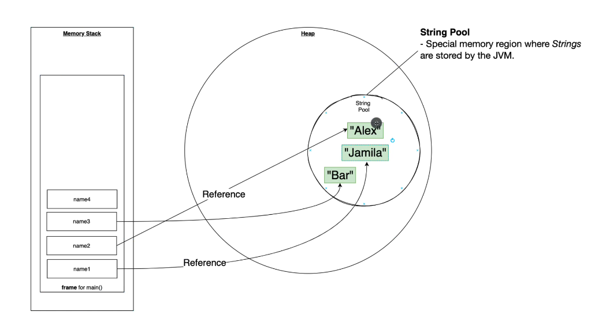

In java Strings are immutable..
The string values never changes.

Only the reference changes.

We can only update the reference to the location of the our new String value.

Here first name3 value was 'Jamila'.
But we changes its reference to Alex.
Now onwards `name3` references to value changes to Alex

We don't have to worry about memory management 
everything handled automatically by garbage collector..
