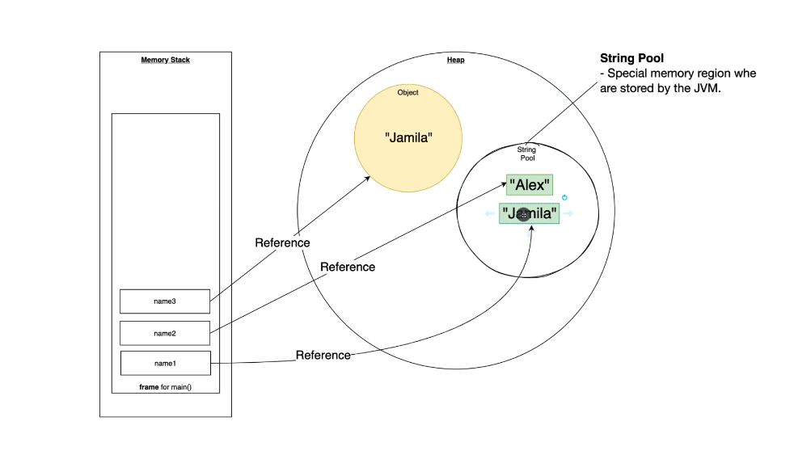
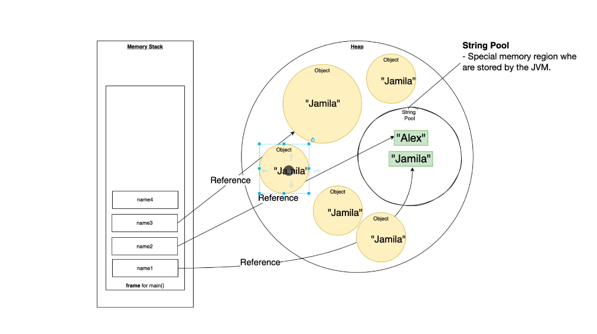

In java String can be defined in several ways...

1. `String name1="Jamila";
String name2="Jamila";`

When we define in this way we are actually points to reference values.


we can also define string by using this method.

2. `String name3 = new String("Jamila");`

But the difference between first and second method of string declaration is

in first method String is stored inside a String pool
In second method String is stored inside a Heap.

;

Here we can see when we define in 2nd method a new object has created in the Heap.


When ever new object with same value created by using 2nd method new object will create inside the Heap

;

````java
String name1="Jamila";
String name2="Jamila";
String name3 = new String("Jamila");
````

Here `name1==name2` ------->True
But `name1!=name3` -------->False

here `==` will only checks reference equality only.
In order to check the value 
we're using `.equals` method.

`name1.equals(name3)`------>True

It will check the equality as per the value.

So it string we `.equals()` method to check for the equality of String.

So when we define a new String It is better to use 1st method ...


