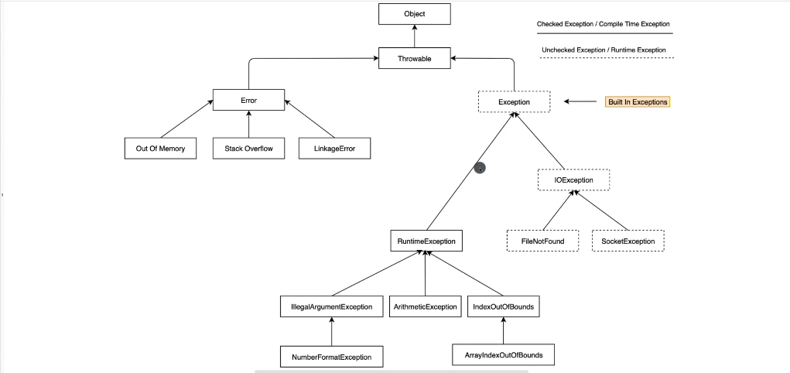

## Execptions...




### Run time exeception


During the execution of the program the execution will runs and gives error result.

```java
//UnChecked Exception
public class Main {
    public static void main(String[] args) {

        try{

            int number=Integer.parseInt("1x");
            System.out.println(number);

            for(int i=10;i>=0;i--){
                System.out.println(10/i);

            }
            System.out.println("End");
        }
        catch (ArithmeticException|NumberFormatException e){
            System.out.println(e.getMessage());
        }

//Catch all exception.
        catch (Exception e){
            System.out.println("Some random Exeception");
        }
        }
    }
```

Here the above code will run until it reaches the exception will shows the error and throws and error result...

In UnChecked Exception even if don't give the **try-and catch** It will run until it reaches the error area.
Once it reaches to error area it will throws out an error.
It will compile and run our code in the case of **UnChecked Exception**.


__Throwable__ is super class of all errors and exceptions.

This is coming from  **java.lang.Throwable**
- We don't have any control for __Error__.
- We have control over __Exception__.

| RunTimeException                                                   | IO Exception                                           |
|--------------------------------------------------------------------|--------------------------------------------------------|
| UnChecked Exception                                                | Checked Exception                                      |
| Exception that can happend during normal execution of the program. | We have to deal with this execpton before compile time |


**IO Exception (Checked Exception)**

1. These exception comes before the compilation of our program
2. We have to deal with Exception before Execution of the program
3. Other wise we can't run our code,This will throws an error.

```java
// Checked Exception
        try {
            File file=new File("src/sample.txt");
            if(!file.exists()){
                file.createNewFile();
            }
        }
        catch (IOException e){
            System.out.println(e.getMessage());
        }

```

For this **Checked Exception** We always enclose it into an try and catch.Other wise it will give un an error before the compilation of our code.
