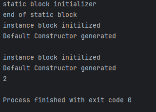

## static block and instance block

Order of preference

**static block > instance block > Constructor**

So when we create a static block 

```java
public class Person {

    public static int count;
//STATIC BLOCK
    static{
        System.out.println("static block initializer");
        count=0;
        System.out.println("end of static block");
    }
//INSTANCE BLOCK    
    {
        System.out.println("instance block initilized");
        count++;

    }

    public Person() {
        System.out.println("Default Constructor generated");
    }
}

```
we can create a static block by using 
```
static {
....
}
```
syntax.
So it will initilaize the values for the __static__ variable..

It will only initilize the value once .

```chatinput
 Person athul=new Person();
 Person akarsh=new Person();
```

So the value initilization only takes place in first **Person** creation time 

```java

//156
public class Main {
    public static void main(String[] args) {
        Person athul=new Person();
        System.out.println();
        Person akhil=new Person();
        System.out.println(Person.count);
    }
}
```
**This will be the output for the above code**



So we can see even though we defined 2 Person instances static block  runs only one time .
But the instance class will run 2 times.


