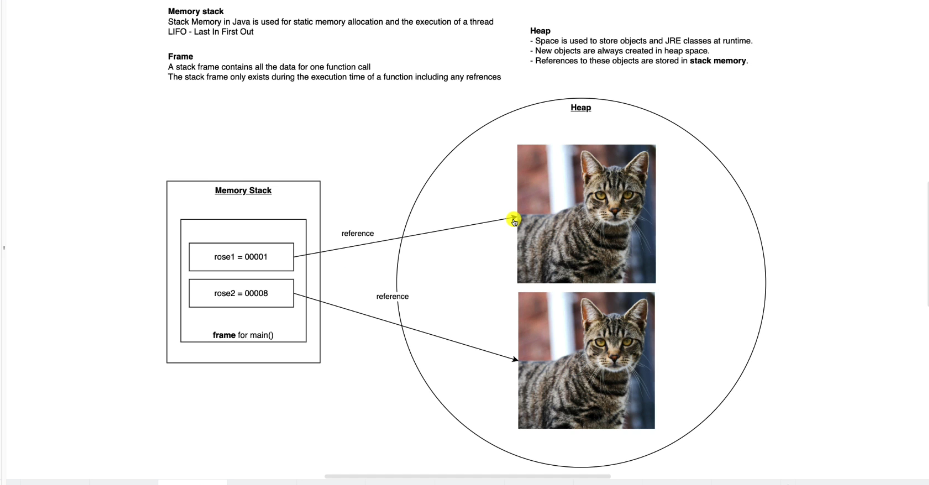
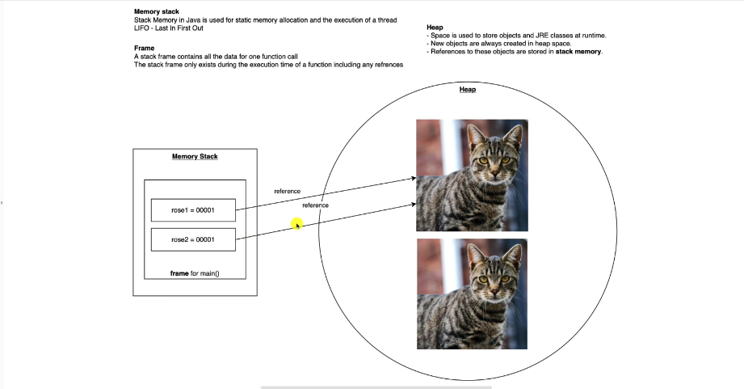

#### Oops...

Equality check
````java
Cat rose1=new Cat("rose",2);
Cat rose2=new Cat("rose",2);

````
compares reference of the 2 objects.

Here when we do `rose1==rose2` java will output it as false.
Here the equality check will conduct based on the reference of the objects.
Here **rose1** point to one object **rose2** will point to different object.

```java
Cat rose1= new Cat("rose",1);
Cat rose2=rose1;

```


Here the `rose1==rose2` is **true**.


